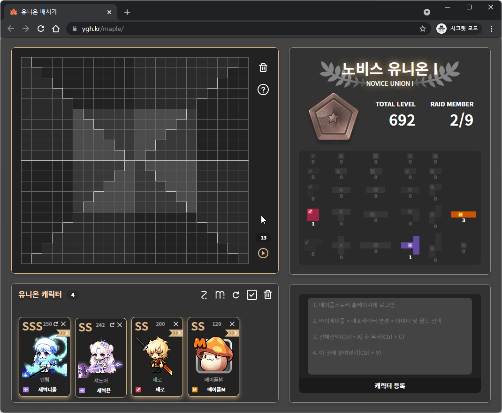
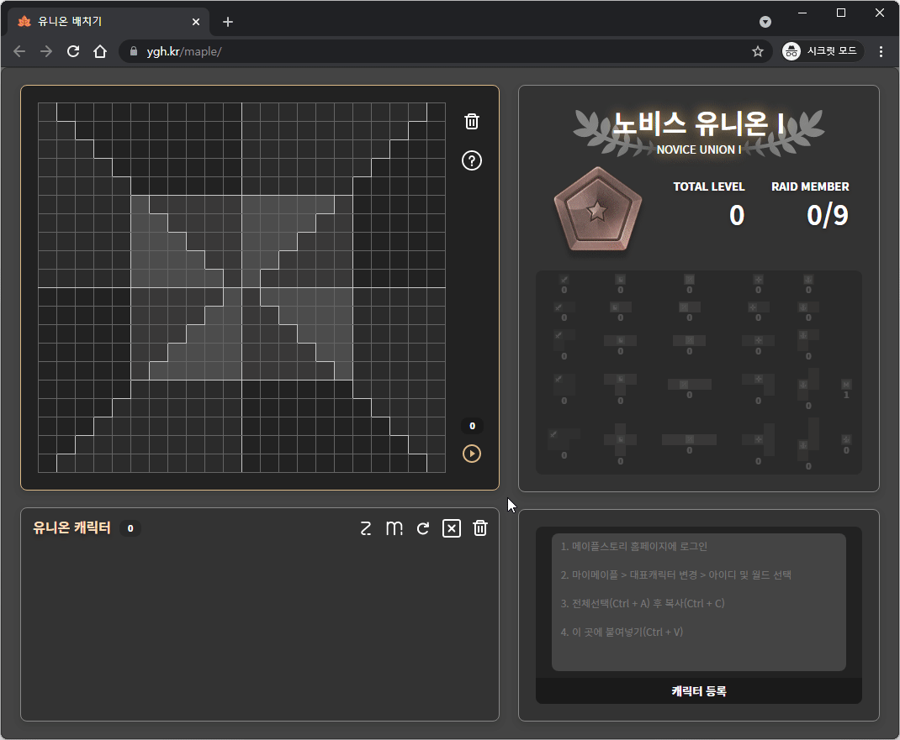
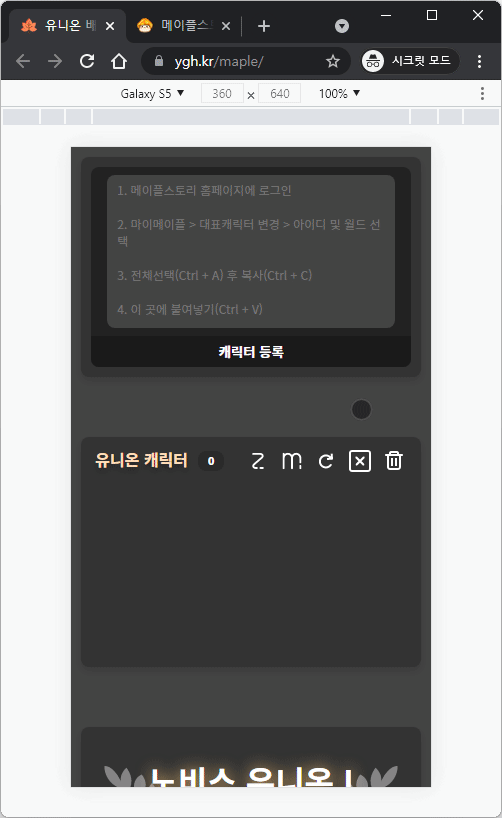

# 메이플 유니온 배치기 https://ygh.kr/maple/

**메이플 스토리** 게임의 **유니온 시스템**을 보다 **편리하게 이용**할 수 있게 도와주는 웹사이트 입니다.
<br><br>

# 개발 환경

- `Node.js v14.17.3`
- `pm2`
  <br><br>

# 일반적인 동작

메이플 스토리 공식 홈페이지에서 캐릭터 정보를 들고와서 원하는 공간을 선택한 뒤 실행하면 타일을 어떻게 배치해야할지 알려줍니다.


<br><br>

# 사용자 지정 조각

자신이 가지고 있지 않은 캐릭터라도 배치를 해보고 싶다면 우측에 조각을 클릭하면 됩니다.

> #### 원래대로
>
> 자신의 캐릭터의 정보만으로 조각을 되돌리고 싶다면 `리셋` 버튼을 누르면 됩니다.


<br><br>

# 저장

웹페이지를 다시 방문할 때 전에 사용한 캐릭터들 정보와 선택한 공간을 불러와줍니다.


<br><br>

# 동기화

캐릭터 정보가 오래되어 정확하지 않다면 회전 화살표 모양을 눌러 동기화 시킬 수 있습니다.


<br><br>

# 모바일

스마트폰에서도 사용가능하도록 CSS만으로 반응형 웹이 구현되어 PC와 동일하게 사용가능 합니다.


<br><br>

# 데이터 베이스 생성 (통계용)

##### sql

```sql
CREATE DATABASE maple DEFAULT CHARACTER SET utf8mb4 COLLATE utf8mb4_general_ci;
SET GLOBAL validate_password.policy=LOW;
CREATE USER maple@localhost identified WITH mysql_native_password BY 'maplemaple';
GRANT ALL PRIVILEGES ON maple.* TO maple@localhost;
FLUSH PRIVILEGES;
```

<br><br>

# 테이블 생성

##### sql

```sql
CREATE TABLE `maple`.`mut_log` (
  `date` DATE NOT NULL,
  `visit` INT NULL,
  `apply` INT NULL,
  `sync` INT NULL,
  PRIMARY KEY (`date`),
  INDEX `mut_log_date_idx` (`date` DESC) VISIBLE);
```
